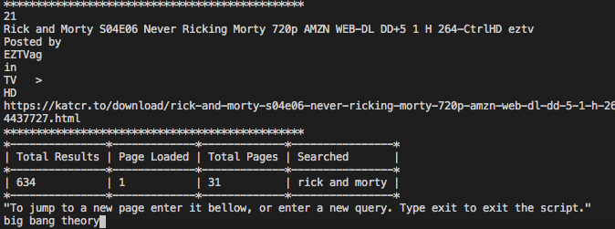

# Ruby Scraper using HTTParty and Nokogiri



## Objectives

1. Target URLS and get DATA
2. Formats data so you can filter via css
3. Displays scraped data in terminal.

## Overview

Have you ever wanted to pull data to automate database creation. Now with ruby you can! Here is an open source scraper I made with Ruby to demo now with your terminal you can scrape public data off sites. This script when activated will make a get request with HTTParty and format with Nokogiri. I then display it in a terminal but as you can imagine with ruby the sky is the limit. Easily build scrapers to populate databases via scripts...just a little glimps at Rubys potential. Run this in your terminal to navigate for torrents without the anoying pop up ads. Its completly open source so feel free to fork and imporve if you want to. Ideas for improvments anyone? Feel free to open a PR. Check out the demo on youtube ...

 https://youtu.be/jvsxBfArJBU

### Your Uncomplicated Ruby Scraper!

With is basic and simple structure you too can have a scraper to help you extract public data from sites. This can help build databases by helping extract data for further dumping and porting to a sql.

### Project Structure

```bash

├── GemFile
│   └── gems required
├── bin
│   └── main.rb
├── lib
│   └── scraper.rb
│   └── table.rb
│  
├── .rubocop.yml
├── .stickler.yml
├── README.md

```

## Built With

- Ruby, Ruby Gems, Rubocop, and target URL.

## Getting Started

1. Clone directory $ git clone https://github.com/rootDEV2990/ruby_scraper
2. Open terminal type cd /path/to/folder and hit enter.
3. Run "ruby ./bin/main.rb" inside your terminal.
4. Script will promp you to input your search query..input query and hit enter.
5. Script will scrape and rescrape as user provides new search inputs. 
6. Bottom table will display page results and number inputs will help you pan pages. 
7. You can click cmd+click on link to open in browser. 
8. Type 'exit' to stop ruby script. 

### Prerequisites

Ruby installed on your computer to be able to run the script.

## What it does:

1. Targets a URL.
2. Gets RAW HTML.
3. Extracts targeted DATA.
4. Displays values in terminal.
5. Allows you to directly navicate to download page 
(*Site requires you to be a member to downlaod, registration is free*)

## Authors

👤 **Miguel Angel Enciso Sanchez**

- Github: [@rootDEV2990](https://github.com/rootDEV2990)
- Twitter: [@m29902](https://twitter.com/m29902)
- Linkedin: [linkedin](https://www.linkedin.com/in/miguel-enciso-6474741a1/)
- Medium: [medium](https://medium.com/@website.dev)

## 🤝 Contributing

Contributions, issues and feature requests are welcome!

Feel free to check the [issues page](issues/).

## Show your support

Give a ⭐️ if you like this project!

Bitcoin donations accepted ;)

1AD5ANtHmqemTZ2Qmv5UqJAMijTNyCAH8D 🚀
